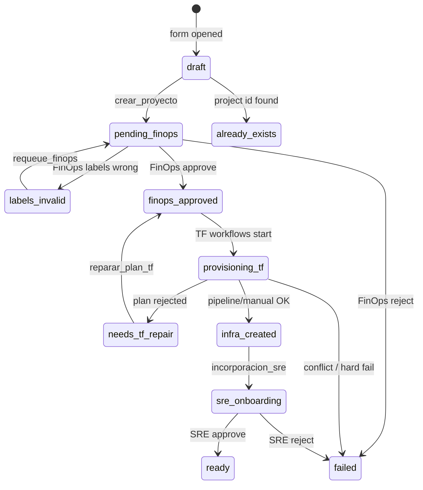

# Architecture — Crear Proyecto template

## Design principles

1. **Workflows only** for orchestration (Port Workflows open beta). No legacy Actions & Automations.
2. **Catalog entity as the bus** — `cloud_project.status` triggers subprocesses via `EVENT_TRIGGER`. Avoids unsupported fan-out inside a single workflow graph.
3. **Customer-owned side effects** — every external system call is a `WEBHOOK` with a stable path under `https://example.com/port-hooks/...` and `onFailure: continue` so demos work before hooks exist.
4. **Humans via `INPUT`** — FinOps, Ing Cloud, SRE, Security approvals use Port input nodes (replace responder emails before go-live).

## Status machine

## Workflow map (BPMN → Port)

| BPMN | Port workflow | Trigger |
|------|---------------|---------|
| port-crear proyecto (main) | `crear_proyecto` | Self-service form |
| proceso Finops | `finops_aprobacion` | Entity → `pending_finops` |
| Proceso TF | `provision_tf` | → `finops_approved` && `!is_j2c` |
| proceso tf j2c | `provision_tf_j2c` | → `finops_approved` && `is_j2c` |
| Incorporación Flujo SRE | `incorporacion_sre` | → `infra_created` |
| Formulario usuarios + Flujo Seguridad | `agregar_usuarios` | Self-service / bolt menu |
| Formulario infra + Flujo creación infra | `agregar_infraestructura` | Self-service / bolt menu |
| reparar plan (TF loop) | `reparar_plan_tf` | Self-service / bolt menu |
| label correction re-entry | `requeue_finops` | Self-service / bolt menu |

## Parallel “usuarios + infra” after SRE

BPMN uses a parallel gateway. Port workflows do not fan out. After `ready`, both follow-ons are **independent** self-service actions on the entity (same outcome for the user, no forced join).

## J2C rule (template default)

- FinOps sets `billing_is_afp_central`.
- If true → `is_j2c = true`.
- If false → FinOps `force_j2c` boolean chooses j2c vs no-j2c.
- Customer can change this rule in `finops_aprobacion` condition/mapping nodes.

## Why event chaining (not workflow-calls-workflow)

`POST /v1/workflows/{id}/runs` can invoke another workflow, but status events:

- keep audit history on the entity,
- survive parent run completion,
- make each subprocess independently retriable,
- match how operators already think about the ticket lifecycle.

## Demo without webhooks

1. Apply template.
2. Set INPUT responders to users you can log in as (or share).
3. Leave webhook URLs on `example.com` (`onFailure: continue`).
4. Run **Crear Proyecto** → approve FinOps → approve TF plan → approve SRE.
5. TF “exists” check defaults to `false` when the webhook fails, so the happy path continues.
